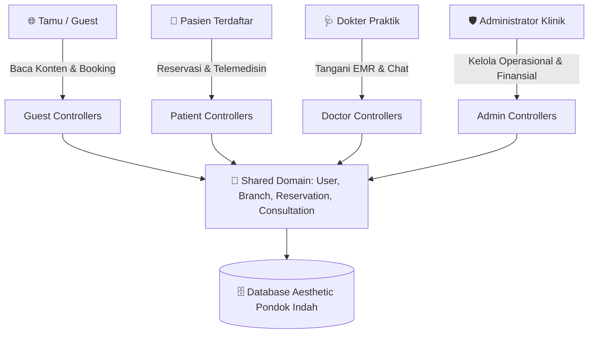

# 🧭 Panduan Arsitektur Controller API (`app/Http/Controllers/Api/`)

Dokumen ini menjelaskan arsitektur controller API yang telah distandarisasi ke dalam **5 Domain Aktor & Entitas** beserta subfolder fitur deskriptif.

---

## 🏛️ Struktur 5 Domain Controller

1. 🔗 **`Shared/`**: Fitur interaksi multi-aktor (Auth, User Akun, Cabang, Wilayah, Media Upload).
2. 🛡️ **`Admin/`**: Operasional klinik, verifikasi, pengaturan, analitik, dan manajemen konten.
3. 🩺 **`Doctor/`**: Praktik klinis dokter, antrean periksa, konsultasi, dan rekam medis EMR.
4. 👤 **`Patient/`**: Pengalaman pasien mandiri (Keanggotaan, Billing, Pengaduan, Notifikasi, Reservasi).
5. 🌐 **`Guest/`**: Akses informasi publik tanpa autentikasi (Layanan, FAQ, Kontak, Artikel, Promo).

---

## 🔄 Pola Komunikasi & Arah Data Antar-Aktor

