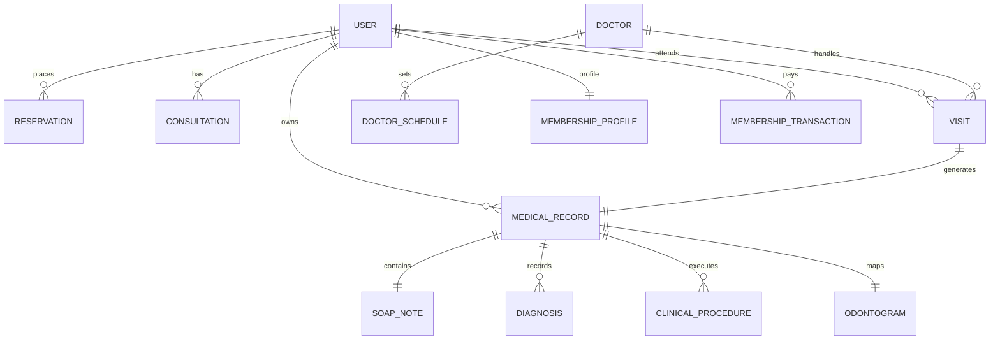

# 🏛️ Panduan Arsitektur Model Eloquent (`app/Models/`)

Direktori ini menampung seluruh representasi model data Eloquent ORM yang terorganisir rapi ke dalam **5 Domain Aktor & Entitas**.

---

## 📁 Struktur 5 Domain Model

1. 🔗 **`Shared/`**: Entitas utama multi-aktor (`User`, `Branch`, `Reservation`, `Consultation`).
2. 🛡️ **`Admin/`**: Model operasional admin (`ClinicSetting`, `DownloadApp`, `Media`, `PageVisit`, `PromoClaim`).
3. 🩺 **`Doctor/`**: Model klinis & EMR (`MedicalRecord`, `SoapNote`, `Diagnosis`, `ClinicalProcedure`, `Odontogram`, `Visit`, `DoctorSchedule`).
4. 👤 **`Patient/`**: Model pasien & membership (`UserProfile`, `MembershipProfile`, `MembershipPoint`, `Invoice`, `Payment`, `Complaint`, `Notification`).
5. 🌐 **`Guest/`**: Model informasi publik (`ClinicService`, `Faq`, `ContactMessage`, `Post`, `Promo`, `Popup`, `GalleryItem`, `Testimonial`, `Wilayah`).

---

## 🗄️ Relasi Data Utama Antar-Domain

